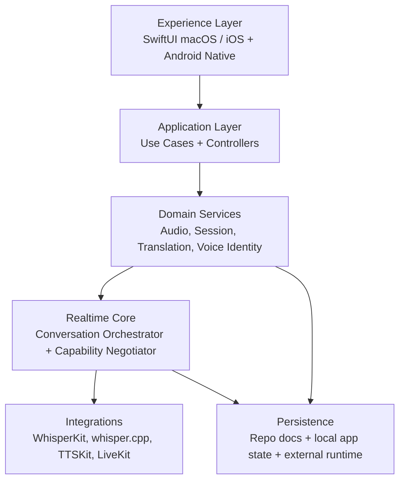

# Arquitetura Base do Voitran

## Decisao base
O Voitran nasce como produto `local-first`:
- audio e IA de baixa latencia priorizados nas pontas;
- backend focado em controle, sessao, presenca, eventos e politicas;
- governanca por artefatos vivos e contratos explicitos.

## Camadas

## Regras estruturais
- controllers e facades ficam finos;
- services sao o unico ponto de escrita de estado de dominio;
- o core nao carrega regra de interface;
- o backend nao processa audio pesado por padrao;
- modelos e caches vivem fora do repo, em runtime externo;
- identidade vocal exige consentimento, escopo e expiracao.

## Componentes alvo
- `apps/macos/VoitranMac`
- `backend/control-plane`
- `packages/realtime-core-swift`
- `apps/ios`
- `apps/android`

## Runtime externo oficial
- `/Volumes/SSDExterno/Voitran_runtime/models`
- `/Volumes/SSDExterno/Voitran_runtime/caches`
- `/Volumes/SSDExterno/Voitran_runtime/voices`
- `/Volumes/SSDExterno/Voitran_runtime/vector`
- `/Volumes/SSDExterno/Voitran_runtime/logs`
